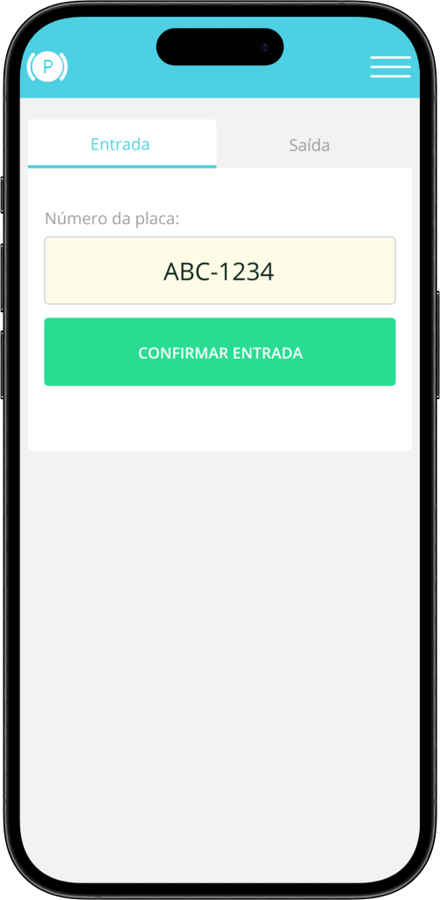

<p align="center">
   
</p>

<br />

<p align="center">	
  
  

  <a href="https://github.com/bkkater/parking-web/commits/master">
    
  </a> 
  
  
</p>

<br />
<br />


# :pushpin: Tabela de Conteúdo

* [Propósito do projeto](#closed_book-propósito-do-projeto)
* [Tecnologias](#computer-tecnologias)
* [Como rodar](#construction_worker-como-rodar)

# :closed_book: Propósito do projeto

Este projeto foi desenvolvido como parte de um desafio de programação, com o objetivo de criar uma aplicação web para gerenciamento de um estacionamento. 

A ideia era utilizar as tecnologias Next.js 14, React 18 e explorar as funcionalidades do Tailwind CSS. O projeto serviu como um desafio pessoal para aprimorar habilidades de desenvolvimento web e explorar novas tecnologias.

# :computer: Tecnologias

Esse projeto foi feito utilizando as seguintes tecnologias:
<details>
  <summary>Front-end</summary>

-   [React](https://pt-br.reactjs.org/)
-   [Next.js](https://nextjs.org/)
-   [Tailwind CSS](https://tailwindcss.com/)
-   [Radix-UI](https://www.radix-ui.com/)
-   [React Hook Form](https://react-hook-form.com/)
-   [Lucide](https://lucide.netlify.app/)
</details>


# :rocket: Funcionalidades

- **Registro de Entrada, Saída de Veículos e Pagamento**: O usuários pode registrar a entrada e saída de veículos, fornecendo sua placa.
- **Histórico do Veículo**: O usuário pode acessar o registro completo do histórico de entrada e saída do veículo, informações sobre o tempo total e pagamento.


# :construction_worker: Como rodar
```bash
# Clone o Repositório
$ git clone https://github.com/bkkater/parking-web.git
# Vá para a pasta parking-web
$ cd parking-web
# Instale as depedencias
$ npm install
# Rode a aplicação
$ npm run dev
```

:closed_book: LICENSE
Esse projeto está sobre MIT license.

